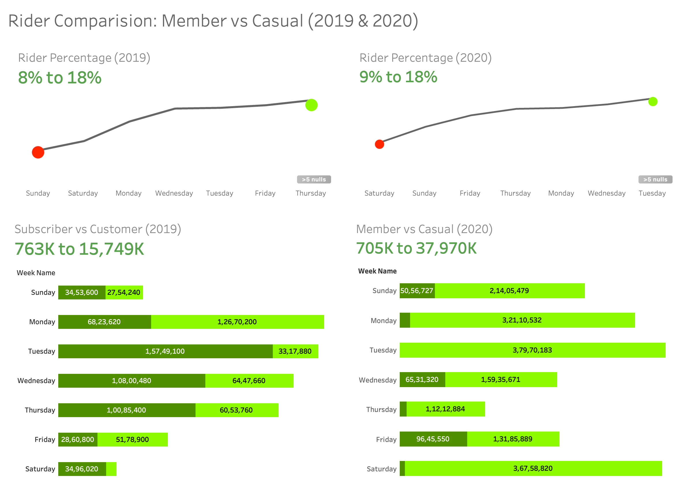

<h1 style= 'color:lightgreen;'>Cyclistic Bike</h1>

### | Summary

- Cyclistic, a bike-share company in Chicago, aims to increase its number of annual memberships. Understanding the usage patterns of casual riders compared to annual members is crucial for designing a marketing strategy that effectively converts casual riders into annual members. The company offers a diverse range of bicycles and caters to both leisure riders and commuters. To gain approval from the detail-oriented Cyclistic executive team, data-driven insights and professional visualizations are necessary.

## Approach for Solution

### | Data Collection and Preparation:

- Gather usage data for both casual riders and annual members, focusing on metrics such as ride frequency, duration, and bike type.
  Ensure the data is clean, accurate, and ready for analysis.
  Data Analysis:

- Compare ride patterns between casual riders and annual members using statistical methods to identify significant differences.
  Analyze factors such as peak usage times, popular routes, and bike types preferred by each group.
  Data Visualization:

- Create compelling visualizations (e.g., scatter plots, bar charts, maps) to clearly illustrate the differences in usage patterns.
  Use visualization tools like Tableau or Power BI to make the data insights accessible and engaging.
  Insights and Recommendations:

- Interpret the analysis results to derive actionable insights about casual riders’ behavior.
  Formulate targeted marketing strategies aimed at converting casual riders to annual members, such as personalized promotions or highlighting the benefits of membership.
  Presentation:

- Prepare a professional report and presentation that clearly communicates the findings and recommendations.
  Use storytelling techniques to make a persuasive case to the Cyclistic executive team, ensuring the proposed strategies are backed by solid data.

<h1 style= 'color:lightgreen;'>🕵🏻‍♂️ASK</h1>

### | Gathering the Datasets and Defining the Business Question.

<span style= 'color:yellow;'> Three questions will guide the future marketing program:

1. How do annual members and casual riders use Cyclistic bikes differently?
2. Why would casual riders buy Cyclistic annual memberships?
3. How can Cyclistic use digital media to influence casual riders to become members?

<span style = 'color:lightgreen;'>We assigned the first question to answer: How do annual members and casual
riders use Cyclistic bikes differently?

<h1 style= 'color:lightgreen;'> 🤝Prepare</h1>

- The task at hand involves analyzing historical trip data from Cyclistic over the past 12 months to identify trends. Although the datasets have different names due to Cyclistic being a fictional company, they are suitable for addressing the business questions. Provided by Motivate International Inc. under a specific license, this public data allows exploration of how various customer types utilize Cyclistic bikes. However, it's important to note that data privacy regulations prevent the use of personally identifiable information. Therefore, it's not possible to link pass purchases to credit card numbers to ascertain if casual riders reside in the Cyclistic service area or have bought multiple single passes.
  Cyclistic service area or if they have purchased multiple single passes.

1. Download the previous 12 months of trip data.
   Note: If you are planning on using Posit’s RStudio, use the Divvy 2019 Q1 and Divvy 2020
   Q1 datasets. Choosing other data might lead to errors because the data exceeds the
   memory available in the free plan.
2. Unzip the files.
3. Create a folder on your desktop or Drive to house the files. Use appropriate file-naming
   conventions.
4. Create subfolders for the .csv file and the .xls or Sheets file so that you have a copy of
   the original data. Move the downloaded files to the appropriate subfolder.
5. Follow these instructions for either Excel (a) or Google Sheets (b):
   a. Launch Excel, open each file, and choose to Save As an Excel Workbook file. Put
   it in the subfolder you created for .xls files.
   b. Open each .csv file in Google Sheets and save it to the appropriate subfolder.
6. Open your spreadsheet and create a column called ride_length. Calculate the length
   of each ride by subtracting the column started_at from the column ended_at (for
   example, =D2-C2) and format as HH:MM:SS using Format > Cells > Time > 37:30:55.
7. Create a column called day_of_week, and calculate the day of the week that each ride
   started using the WEEKDAY command (for example, =WEEKDAY(C2,1)) in each file.
   Format as General or as a number with no decimals, noting that 1 = Sunday and 7 =
   Saturday.
8. Proceed to the Process step.

[Download Excle file](Excel Datasets/Divvy_Trips_2019_cleaned.csv)
[Download Excel file](Excel Datasets/Divvy_Trips_2020_cleaned.csv)

<h1 style= 'color:lightgreen;'> 🧩Process</h1>

- Cleaning datasets using PostgresSQL in VScode.

1. importing cleaned dataset in csv formate in to the VScode and creating tables.
2. Checking for the duplicates using COUNT function.
3. Checking all data row and columns are unique the data is complete.

```sql
-- Creating table for daily_rider_2019
CREATE TABLE daily_rider_2019 AS
SELECT dr.trip_id,
      dr.bike_id,
      dr.start_time,
      dr.end_time,
      dr.from_station_id,
      dr.from_station_name,
      dr.to_station_id,
      dr.to_station_name,
      dr.trip_duration,
      dr.gender,
      dr.user_type,
      dr.birth_year,
      rl.rider_length,
      wd.week_name
FROM daily_ryder_2019 dr
      JOIN rider_length rl ON rl.trip_id = dr.trip_id
      JOIN weekly_days wd ON wd.trip_id = rl.trip_id

-- Creating table for daily_rider_2020
CREATE TABLE daily_rider_2020 AS
SELECT dr.ride_id,
      dr.rideable_type,
      dr.start_station_id,
      dr.start_station_name,
      dr.end_station_id,
      dr.end_station_name,
      dr.started_at,
      dr.ended_at,
      dr.start_lat,
      dr.end_lat,
      dr.start_lng,
      dr.end_lng,
      dr.member_casual,
      rl.rider_length,
      wr.week_name
FROM daily_ryder_2020 dr
      JOIN rider_lengths rl ON rl.ride_id = dr.ride_id
      JOIN weekly_rides wr ON rl.ride_id = wr.ride_id
```

- Cleaning the table:

```sql
SELECT ride_id, COUNT(*)
FROM daily_ryder_2020
GROUP BY ride_id
HAVING COUNT(*) > 1
LIMIT 100

ALTER TABLE daily_ryder_2020
ALTER COLUMN ride_id SET NOT NULL


ALTER TABLE daily_ryder_2020
ADD CONSTRAINT daily_ryder_2020_pkey PRIMARY KEY (ride_id)

SELECT column_name, data_tyep
FROM information_schema.columns
WHERE table_name = 'daily_ryder_2020'

SELECT kcu.column_name
FROM information_schema.table_constraints tc
JOIN information_schema.key_column_usage kcu ON kcu.constraint_name = tc.constraint_name
WHERE tc.constraint_type = 'PRIMARY KEY' AND tc.table_name = 'daily_ryder_2020'
```

- we have found there are no duplicates as we have also checked in excle. We can proceed with analyze phase.

<h1 style= 'color:lightgreen;'> 📚Analyze</h1>

- Here we'll Create the Ryder_length column by subtracting the end_at with start_at in both the tables.

```sql
CREATE TABLE rider_lengths AS

SELECT ride_id,
      ROUND(EXTRACT(EPOCH FROM (ended_at - started_at))) AS rider_length
FROM daily_ryder_2020
```

- Now we can create another column with week_days which will consists of all the days of the week.

```sql
-- Weekname from the week_day
-- Creating week_days column
CREATE TABLE weekly_days AS WITH week_days AS (
      SELECT trip_id,
            EXTRACT(
                  DOW
                  FROM end_time
            ) AS week_day
      FROM daily_ryder_2019
)
SELECT trip_id,
      CASE
            WHEN week_day = 0 THEN 'Sunday'
            WHEN week_day = 1 THEN 'Monday'
            WHEN week_day = 2 THEN 'Tuesday'
            WHEN week_day = 3 THEN 'Wednesday'
            WHEN week_day = 4 THEN 'Thursday'
            WHEN week_day = 5 THEN 'Friday'
            ELSE 'Saturday'
      END AS week_name
FROM week_days
```

- After having all the columns we can now proceed with further analysis.
- Calculating the percentage of the riders and grouping them by rider_length and week_names.

```sql
WITH week_days AS (
      SELECT week_name
      FROM daily_rider_2019
),
rider_counts AS (
      SELECT week_name,
            COUNT(*) rider_count
      FROM weekly_days
      GROUP BY week_name
),
total_rider_counts AS (
      SELECT SUM(rider_count) AS total_rider_count
      FROM rider_counts
)
SELECT rc.week_name,
      rc.rider_count,
      ROUND(
            (rc.rider_count / trc.total_rider_count * 100),
            2
      ) AS rider_percentage
FROM rider_counts rc,
      total_rider_counts trc
ORDER BY rider_percentage ASC
```

- Same we'll do it for another table and group with week_names and rider_length.
- Now we can see the difference bw the percentage of riders in 2019 and 2020.

## 2019


## 2020


- Now we'll calculate the standard deveation of both the tables. (mean, median, mode) we'll consider the data bw 3 to -3 to define outliers.

```sql
WITH stats AS (
            SELECT AVG(rider_length) AS mean_rider_length,
                  STDDEV(rider_length) AS stddev_rider_length,
                  AVG(trip_duration) AS mean_trip_duration,
                  STDDEV(trip_duration) AS stddev_trip_duration
            FROM daily_rider_2019
      ),
      outliers AS (
            SELECT dr.rider_length,
                  dr.trip_duration,
                  dr.user_type,
                  dr.week_name,
                  CASE
                        WHEN ABS(
                              (dr.rider_length - s.mean_rider_length) / s.stddev_rider_length
                        ) > 3
                        OR ABS(
                              (dr.trip_duration - s.mean_trip_duration) / s.stddev_trip_duration
                        ) > 3 THEN 1
                        ELSE 0
                  END AS is_outlier
            FROM daily_rider_2019 dr
                  CROSS JOIN stats s
      )
      SELECT rider_length,
            trip_duration,
            user_type,
            week_name
      FROM outliers
      WHERE is_outlier = 1
      ORDER BY rider_length,
            trip_duration
```

- similarly doing it for 2020 we'll get for bar charts.

## 2019


## 2020


- As of now we got the data to differentiate the rider from 2019 and 2020. Bwteen member and casual riders.
  Now we can for for Creating Dashboard.

<h1 style= 'color:lightgreen;'> 📊Visualize</h1>

## | Dashboard

- After having our charts using Tableau
  we can now combine those chart to get our Dashboard which comparision bw riders 2019 and 2020.

## | Tableau (Riders Comparison 2019 VS 2020)



- we can clearly see in the above charts.

1. Riders in 2019 are taking more memberships and veryless casual riders.
2. There is increase on the Business days as if the riders are using Cyclistic for working purpose.
3. But in 2020 riders has been increased as per the bar_chart.
4. There has been a drastic increase in the Casual riders than Member rides.
5. In 2020 mostly riders has been seen riding on weed_days.
6. Our analysis shows there is increase in the Casual riders in 2020 when compare to 2019.

<h1 style= 'color:lightgreen;'> 🌻Conclusion</h1>

## | Insights

In 2019, there were more memberships and fewer casual riders compared to 2020.
There was an increase in ridership on business days, indicating more people using Cyclistic for work commutes.
Ridership increased overall in 2020 according to the bar chart data.
There was a significant increase in casual ridership compared to member rides in 2020.
In 2020, riders were mostly seen riding on weekdays.
Analysis shows a notable increase in casual ridership in 2020 compared to 2019.

## Suggestions for improving membership:

- Offer promotions or discounts for annual memberships to incentivize more riders to become members.
- Enhance marketing efforts targeting commuters, highlighting the convenience and cost-effectiveness of annual memberships for daily commuting.
- Introduce loyalty programs or rewards for frequent riders to encourage them to switch to annual memberships.
- Improve user experience on the Cyclistic app or website, making it easier for riders to sign up for memberships and manage their accounts.
- Collaborate with local businesses or organizations to offer corporate membership packages, attracting more commuters to join as members.
- Conduct surveys or feedback sessions with casual riders to understand their reasons for not opting for memberships and address any concerns or barriers they may have.
