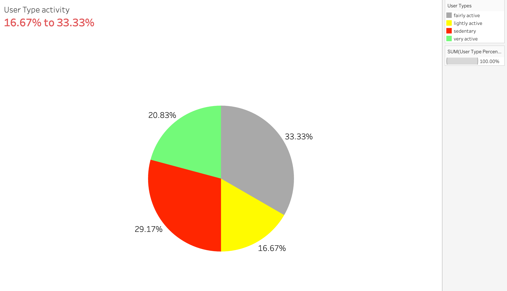
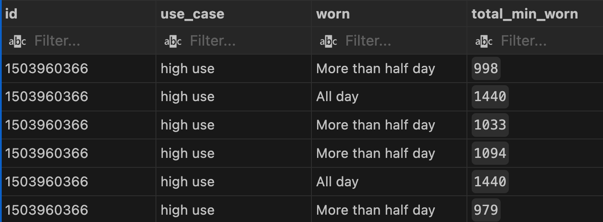

# Bella Beat

## Summary

### Introduction

Bellabeat is a high-tech company that manufactures health-focused smart products. They offer a range of smart devices designed to collect data on activity, sleep, stress, and reproductive health, empowering women with insights into their own health and habits. This case study focuses on analyzing fitness data from Bellabeat's smart devices to uncover new growth opportunities for the company. Specifically, we will concentrate on the Bellabeat app, a key product in their lineup.

### **Bellabeat App**

The Bellabeat app is designed to provide users with comprehensive health data, including information about their activity, sleep, stress levels, menstrual cycle, and mindfulness habits. By connecting to Bellabeat’s smart wellness products, the app allows users to gain a deeper understanding of their health patterns and make informed decisions to improve their well-being. This data integration helps users track and analyze their health metrics in real-time, offering personalized insights and recommendations.

### **Objectives**

The primary objective of this analysis is to explore how fitness data from Bellabeat's smart devices can be leveraged to identify new growth opportunities. This involves understanding user behavior, identifying trends, and providing actionable insights that can enhance the user experience and drive product development.

### **Data Analysis Plan**

To achieve these objectives, we will conduct a comprehensive analysis of the data collected from Bellabeat’s smart devices. This includes:

1. **Data Collection**: Gathering data on user activity, sleep patterns, stress levels, menstrual cycles, and mindfulness habits.
2. **Data Cleaning**: Ensuring the data is clean, accurate, and ready for analysis.
3. **Descriptive Analysis**: Summarizing the data to understand the basic characteristics and trends.
4. **Exploratory Data Analysis (EDA)**: Visualizing data to uncover patterns and correlations.
5. **Predictive Analysis**: Using statistical models to predict future trends and behaviors.
6. **Recommendation Development**: Based on the insights gained, providing recommendations for product enhancement and new feature development.

# Ask

### **1. Activity Data**

- Analyzing user activity levels, including steps taken, distance covered, and active minutes.
- Identifying peak activity times and common activity patterns among users.

### **2. Sleep Data**

- Examining sleep duration and quality, including total sleep time and sleep stages (light, deep, REM).
- Understanding factors that contribute to better sleep and identifying common sleep issues.

### **3. Stress Data**

- Evaluating stress levels and their fluctuations throughout the day.
- Correlating stress data with other factors such as activity and sleep to identify stress triggers.

### **4. Menstrual Cycle Data**

- Tracking menstrual cycle patterns and symptoms.
- Providing insights into how menstrual cycles affect other health metrics such as activity and sleep.

### **5. Mindfulness Data**

- Assessing mindfulness habits and their impact on overall well-being.
- Identifying trends in mindfulness practices and their correlation with stress and sleep quality.

### **Visualization Techniques**

To effectively communicate our findings, we will use various visualization techniques, including:

- **Histograms and Box Plots**: To display the distribution of activity, sleep, and stress data.
- **Scatter Plots**: To analyze correlations between different health metrics (e.g., daily steps vs. daily sleep, daily steps vs. daily calories).
- **Line Charts**: To track changes in health metrics over time.
- **Pie Charts**: To show the composition of different activities or sleep stages.

### **Expected Outcomes**

By analyzing the data from Bellabeat’s smart devices, we aim to uncover valuable insights that can:

1. **Enhance User Experience**: Provide users with more personalized and actionable insights to improve their health and wellness.
2. **Drive Product Development**: Identify new features and improvements for Bellabeat’s smart wellness products.
3. **Support Marketing Strategies**: Highlight key trends and user behaviors that can inform targeted marketing campaigns.
4. **Identify Growth Opportunities**: Explore new market segments and potential areas for product expansion.

# ASK phase:

dentify trends in how consumers use non-Bellabeat smart devices to apply insights into Bellabeat’s marketing strategy.

Stakeholders

- Urška Sršen - Bellabeat cofounder and Chief Creative Officer
- Sando Mur - Bellabeat cofounder and key member of Bellabeat executive team
- Bellabeat Marketing Analytics team

# Prepare

### **Dataset Used:**

The dataset for this case study is the FitBit Fitness Tracker Data, sourced from Kaggle and made available by Mobius.

### **Accessibility and Privacy of Data:**

The dataset is open-source, as confirmed by its metadata. The owner has dedicated the work to the public domain, waiving all rights under copyright law. This means the dataset can be copied, modified, distributed, and used for commercial purposes without seeking permission.

### **Information About Our Dataset:**

Collected via a distributed survey through Amazon Mechanical Turk, this dataset includes data from 30 Fitbit users, tracked between 2016-03-12 and 2016-05-12. The dataset comprises minute-level data on physical activity, heart rate, and sleep monitoring, reflecting the use of various Fitbit devices and individual tracking preferences.

### **Data Organization and Verification:**

The dataset consists of 18 CSV files, each representing different quantitative metrics tracked by Fitbit. Each row in the dataset corresponds to a time point per user, with multiple rows per user. Users are identified by unique IDs, and data is tracked by day and time. Verification was performed by creating Pivot Tables in Excel, sorting and filtering the tables to understand attributes, observations, and relationships between the tables. The sample size (users) and the 31-day analysis period were confirmed.

### **Data Credibility and Integrity:**

The dataset is limited by its small sample size (30 users) and lack of demographic information, which may introduce sampling bias. The sample may not be representative of the broader population. Additionally, the dataset is not current and is limited to a two-month survey period. Therefore, the case study will adopt an operational approach to account for these limitations.

# Process

Importing the datasets:

- Daily_activity
- Daily_sleep
- Hourly_steps

```jsx
-- Creating the table for daily_activity, daily_sleep, hourly_steps

CREATE TABLE daily_activity(
      id BIGINT NOT NULL,ActivityDate DATE,total_steps INT,total_distance FLOAT,tracker_distance FLOAT,log_active_distance FLOAT,very_active_distance FLOAT,mod_active_distance FLOAT,light_active_distance FLOAT,sedent_active_distance FLOAT,very_active_min INT,fairly_active_min INT,light_active_min INT,sedent_min INT,calories INT
)
DROP TABLE daily_activity
CREATE TABLE daily_sleep(
      id BIGINT NOT NULL,sleep_day DATE,total_sleep_record INT,total_min_sleep INT,total_time_bed INT
)
DROP TABLE daily_sleep
CREATE TABLE hourly_steps(
      id BIGINT NOT NULL,activity_hour TIMESTAMP WITH TIME ZONE,step_total INT
)

-- Copy data with the file path

-- Copying data from dailyactivity_merged
COPY daily_activity
FROM '/Users/saquibhazari/Desktop/Fitbase Data/Fitabase Data 4.12.16-5.12.16/dailyActivity_merged.csv'
WITH (FORMAT csv, HEADER true, DELIMITER ',', ENCODING 'UTF8')

-- Copying path from sleepday_merged
COPY daily_sleep
FROM '/Users/saquibhazari/Desktop/Fitbase Data/Fitabase Data 4.12.16-5.12.16/sleepDay_merged.csv'
WITH (FORMAT csv, HEADER true, DELIMITER ',', ENCODING 'UTF8')

-- Copying path from hourlySteps_merged
COPY hourly_steps
FROM '/Users/saquibhazari/Desktop/Fitbase Data/Fitabase Data 4.12.16-5.12.16/hourlySteps_merged.csv'
WITH (FORMAT csv, HEADER true, DELIMITER ',', ENCODING 'UTF8')
```

# Cleaning and formatting:

Now we’ll process the data if the data is consistent or not.

Removing the duplicates data from the dataset.

- Now we’ll look for the unique user as the the datasets although the data is minimalistic.
- Removing the duplicates form all three datasets
- We found the data is clean with no duplicates.
- Checking the idk and columns using the LENGTH function if there is any spaces bw and using TRIM function to remove the spaces.

### Cleaning and Rename the data columns.

- Cleaning the data and we need to make sure that the dataset column name is in lowercase cuz we’ll use them to merge together.

### Consistency of data and time columns.

- For daily activity we are merging them together so it’s disregards to chage it’s date and time to Timestamps.

```jsx
SELECT id,
            activity_hour::date AS date,
            activity_hour::time AS time, step_total
      FROM hourly_steps
```

### Checking the clean dataset:

- Now we’ll check the clean dataset
- For hourly_steps we’ll change the date to date and time using Timpstamps.

### Merging the dataset Daily_activity with daily_sleep;

- we’ll merge the dataset daily_activity with daily_sleep and try to find the correaltion between them using the primary key as id, date.

CREATE TABLE daily_activity_sleep(
id BIGINT NOT NULL,activitydate DATE,total_steps INT,total_distance FLOAT,tracker_distance FLOAT,log_active_distance FLOAT,very_active_distance FLOAT,mod_active_distance FLOAT,light_active_distance FLOAT,sedent_active_distance FLOAT,fairly_active_min INT,sedent_min INT,calories INT,total_sleep_record INT,total_min_sleep INT,total_time_bed INT
)

- Creating copy path

```jsx
COPY daily_activity_sleep
FROM '/Users/saquibhazari/Desktop/Fitbase Data/join_data/daily_sleep_activity.csv'
WITH (FORMAT csv, HEADER true, DELIMITER ',', ENCODING 'UTF8')
```

# Analyze

### CREATING Total steps by users:

Now as we have merged both the tables as Daily_activity_sleep we can find the average steps taken by users and can categorize them by there steps.

```jsx
WITH categorized_users AS (
      SELECT
            id,
            ROUND(AVG(total_steps), 2) AS avg_steps,
            ROUND(AVG(calories), 2) AS avg_calories,
            ROUND(AVG(total_min_sleep), 2) AS avg_min_sleep,
            CASE
                  WHEN ROUND(AVG(total_steps), 2) < 5000 THEN 'sedentary'
                  WHEN ROUND(AVG(total_steps), 2) >= 5000 AND ROUND(AVG(total_steps), 2) <= 7499 THEN 'lightly active'
                  WHEN ROUND(AVG(total_steps), 2) >= 7499 AND ROUND(AVG(total_steps), 2) <= 9999 THEN 'fairly active'
                  WHEN ROUND(AVG(total_steps), 2) > 9999 THEN 'very active'
                  ELSE 'not active'
            END AS user_types
      FROM daily_activity_sleep
      GROUP BY id
      ORDER BY id ASC
),
user_type_counts AS (
      SELECT user_types,
      COUNT(*) AS user_count
      FROM categorized_users
      GROUP BY user_types
),
total_users AS (
      SELECT SUM(user_count) AS total_count
      FROM user_type_counts
)
SELECT
      utc.user_types,
      utc.user_count,
      ROUND((utc.user_count::numeric/tu.total_count) * 100, 2) AS user_type_percentage
FROM total_users tu, user_type_counts utc
ORDER BY utc.user_types
```




### To create week days steps and sleep

Now as we have the daily_activity_sleep we can calculate the steps and sleep per week days.

```jsx
 CREATE TABLE usertype_weekdays AS
SELECT
    id,
    ROUND(AVG(total_steps), 2) AS avg_steps,
    ROUND(AVG(calories), 2) AS avg_calories,
    ROUND(AVG(total_min_sleep), 2) AS avg_min_sleep,
    CASE
        WHEN ROUND(AVG(total_steps), 2) < 5000 THEN 'sedentary'
        WHEN ROUND(AVG(total_steps), 2) >= 5000 AND ROUND(AVG(total_steps), 2) <= 7499 THEN 'lightly active'
        WHEN ROUND(AVG(total_steps), 2) >= 7499 AND ROUND(AVG(total_steps), 2) <= 9999 THEN 'fairly active'
        WHEN ROUND(AVG(total_steps), 2) > 9999 THEN 'very active'
        ELSE 'not active'
    END AS user_types,
    CASE
        WHEN EXTRACT(DOW FROM activitydate) = 0 THEN 'Sunday'
        WHEN EXTRACT(DOW FROM activitydate) = 1 THEN 'Monday'
        WHEN EXTRACT(DOW FROM activitydate) = 2 THEN 'Tuesday'
        WHEN EXTRACT(DOW FROM activitydate) = 3 THEN 'Wednesday'
        WHEN EXTRACT(DOW FROM activitydate) = 4 THEN 'Thursday'
        WHEN EXTRACT(DOW FROM activitydate) = 5 THEN 'Friday'
        ELSE 'Saturday'
    END AS weekday_name
FROM daily_activity_sleep
GROUP BY id, activitydate
ORDER BY id ASC;

 -- Creating week days from the about new usertype_weekdays table
 SELECT
      weekday_name,
      ROUND(AVG(avg_min_sleep), 2) AS daily_sleep,
      ROUND(AVG(avg_steps), 2) AS daily_steps
      FROM usertype_weekdays
      GROUP BY weekday_name
      ORDER BY
      CASE weekday_name
            WHEN 'Monday' THEN 1
            WHEN 'Tuesday' THEN 2
            WHEN 'Wednesday' THEN 3
            WHEN 'Thursday' THEN 4
            WHEN 'Friday' THEN 5
            WHEN 'Saturday' THEN 6
            WHEN 'Sunday' THEN 7
      END
```


### Creating table of daily usage:

Now using the initial daily_activitty_sleep table finding the daily usage.

```jsx
CREATE TABLE daily_usage AS
      WITH daily_use AS (
            SELECT id, COUNT(DISTINCT activitydate::date) AS daily_usage
      FROM daily_activity_sleep
      GROUP BY id
      )
      SELECT id, daily_usage,
      CASE
                  WHEN daily_usage >= 1 AND daily_usage <= 10 THEN 'low use'
                  WHEN daily_usage >= 11 AND daily_usage <= 20 THEN 'moderate use'
                  WHEN daily_usage >= 21 AND daily_usage <= 31 THEN 'high use'
                  ELSE 'no use'
            END AS use_cases
      FROM daily_use
      ORDER BY id
```


### Finding the Percentage:

Grouping them with use_cases and calculating the percentage use cases. And calculating the percentage of use case.

```jsx
WITH usage_cte AS (
    SELECT
        id,
        COUNT(DISTINCT activitydate::date) AS daily_usage
    FROM daily_activity_sleep
    GROUP BY id
),
categorized_usage AS (
    SELECT
        id,
        daily_usage,
        CASE
            WHEN daily_usage >= 1 AND daily_usage <= 10 THEN 'low use'
            WHEN daily_usage >= 11 AND daily_usage <= 20 THEN 'moderate use'
            WHEN daily_usage >= 21 AND daily_usage <= 31 THEN 'high use'
            ELSE 'no use'
        END AS use_case
    FROM usage_cte
),
time_usages AS (
    SELECT
        id,
        very_active_min + fairly_active_min + light_active_min + sedent_min AS total_min_worn
    FROM time_usage
),
classified_time_usages AS (
    SELECT
        id,
        total_min_worn,
        ROUND((total_min_worn::numeric / 1440) * 100, 2) AS percent_min_worn,
        CASE
            WHEN ROUND((total_min_worn::numeric / 1440) * 100, 2) = 100 THEN 'All day'
            WHEN ROUND((total_min_worn::numeric / 1440) * 100, 2) < 100 AND ROUND((total_min_worn::numeric / 1440) * 100, 2) > 50 THEN 'More than half day'
            WHEN ROUND((total_min_worn::numeric / 1440) * 100, 2) <= 50 THEN 'Less than half day'
            ELSE 'NA'
        END AS worn
    FROM time_usages
),
combined_usage AS (
    SELECT
        cu.id,
        cu.use_case,
        ctu.worn
    FROM categorized_usage cu
    JOIN classified_time_usages ctu ON cu.id = ctu.id
),
usage_counts AS (
    SELECT
        use_case,
        worn,
        COUNT(*) AS user_count
    FROM combined_usage
    GROUP BY use_case, worn
),
total_users AS (
    SELECT
        COUNT(*) AS total_count
    FROM combined_usage
)
SELECT
    uc.use_case,
    uc.worn,
    uc.user_count,
    ROUND((uc.user_count::numeric / tu.total_count) * 100, 2) AS percent_users
FROM
    usage_counts uc,
    total_users tu
ORDER BY uc.use_case, uc.worn
```


### Calculating:

Finding the daily worn by each user and giving them naming covection.

```jsx
WITH time_usages AS (
    SELECT
        id,  -- Include id to identify each row
        very_active_min + fairly_active_min + light_active_min + sedent_min AS total_min_worn
    FROM time_usage
)

SELECT
    tu.id,
    tu.total_min_worn,
    ROUND((tu.total_min_worn::numeric / 1440) * 100, 2) AS percent_min_worn,  -- Corrected the divisor to 1440 (total minutes in a day)
    CASE
        WHEN ROUND((tu.total_min_worn::numeric / 1440) * 100, 2) = 100 THEN 'All day'
        WHEN ROUND((tu.total_min_worn::numeric / 1440) * 100, 2) < 100 AND ROUND((tu.total_min_worn::numeric / 1440) * 100, 2) > 50 THEN 'More than half day'
        WHEN ROUND((tu.total_min_worn::numeric / 1440) * 100, 2) <= 50 THEN 'Less than half day'
        ELSE 'NA'
    END AS worn
FROM time_usages tu
ORDER BY tu.id
```


### Calculating the total percentage user wearing:

find the the worn percentage by the users.

```jsx
WITH time_usages AS (
    SELECT
        id,
        very_active_min + fairly_active_min + light_active_min + sedent_min AS total_min_worn
    FROM time_usage
),
classified_usage AS (
    SELECT
        id,
        total_min_worn,
        ROUND((total_min_worn::numeric / 1440) * 100, 2) AS percent_min_worn,
        CASE
            WHEN ROUND((total_min_worn::numeric / 1440) * 100, 2) = 100 THEN 'All day'
            WHEN ROUND((total_min_worn::numeric / 1440) * 100, 2) < 100 AND ROUND((total_min_worn::numeric / 1440) * 100, 2) > 50 THEN 'More than half day'
            WHEN ROUND((total_min_worn::numeric / 1440) * 100, 2) <= 50 THEN 'Less than half day'
            ELSE 'NA'
        END AS worn
    FROM time_usages
),
usage_counts AS (
    SELECT
        worn,
        COUNT(*) AS user_count
    FROM classified_usage
    GROUP BY worn
),
total_users AS (
    SELECT
        COUNT(*) AS total_count
    FROM classified_usage
)
SELECT
    uc.worn,
    uc.user_count,
    ROUND((uc.user_count::numeric / tu.total_count) * 100, 2) AS percent_users
FROM
    usage_counts uc,
    total_users tu
ORDER BY uc.worn
```


### Calculating the highest min user wearing: Combining the usage

```jsx
WITH usage_cte AS (
    SELECT
        id,
        COUNT(DISTINCT activitydate::date) AS daily_usage
    FROM daily_activity_sleep
    GROUP BY id
),
categorized_usage AS (
    SELECT
        id,
        daily_usage,
        CASE
            WHEN daily_usage >= 1 AND daily_usage <= 10 THEN 'low use'
            WHEN daily_usage >= 11 AND daily_usage <= 20 THEN 'moderate use'
            WHEN daily_usage >= 21 AND daily_usage <= 31 THEN 'high use'
            ELSE 'no use'
        END AS use_case
    FROM usage_cte
),
time_usages AS (
    SELECT
        id,
        very_active_min + fairly_active_min + light_active_min + sedent_min AS total_min_worn
    FROM time_usage
),
classified_time_usages AS (
    SELECT
        id,
        total_min_worn,
        ROUND((total_min_worn::numeric / 1440) * 100, 2) AS percent_min_worn,
        CASE
            WHEN ROUND((total_min_worn::numeric / 1440) * 100, 2) = 100 THEN 'All day'
            WHEN ROUND((total_min_worn::numeric / 1440) * 100, 2) < 100 AND ROUND((total_min_worn::numeric / 1440) * 100, 2) > 50 THEN 'More than half day'
            WHEN ROUND((total_min_worn::numeric / 1440) * 100, 2) <= 50 THEN 'Less than half day'
            ELSE 'NA'
        END AS worn
    FROM time_usages
),
combined_usage AS (
    SELECT
        cu.id,
        cu.use_case,
        ctu.worn,
        ctu.total_min_worn
    FROM categorized_usage cu
    JOIN classified_time_usages ctu ON cu.id = ctu.id
)
SELECT
    id,
    use_case,
    worn,
    total_min_worn, ROUND((total_min_worn::numeric/1440)* 100, 2) AS
    percent_min_worn
FROM
    combined_usage
WHERE use_case = 'high use'
ORDER BY id
```



# Share:

Creating a dashboard in Tableau:


- As per our plots, 36% of users wear the device all day long, 60% for more than half the day, and only 4% for less than half the day.
- When filtering the users based on the number of days they have used the device, and also taking into account daily usage time, we get the following results:
  - High use: Users who use their device between 21 and 31 days. Only 6.8% of these users wear the device all day. The majority, 88.9%, wear the device for more than half the day but not the entire day.
  - Moderate use: These are the users who use their device between 10 and 20 days. Interestingly, these users tend to wear the device for the shortest periods on a daily basis.
  - Low use: These are the users who use their device between 1 and 10 days. Despite using the device for fewer days, these users tend to wear their device for the longest periods on the days they do use it.

# Conclusion

## Recommendations for Bellabeat:

1. **Daily Notifications and Posts on App:** We classified users into four categories and found that on an average, users walk more than 7,500 steps daily (apart from Sundays). To encourage customers to reach the daily recommended 8,000 steps by the CDC, we can send them notifications if they haven't reached this goal. We can also create posts on our app explaining the benefits of achieving this target.
2. **Sleep Notifications and Techniques:** Our results showed that users sleep less than the recommended 8 hours a day. We could allow users to set a desired sleep time and send them a notification a few minutes before this time to prepare for sleep. Additionally, we can offer helpful resources to aid sleep (e.g., breathing techniques, podcasts with relaxing music).
3. **Reward System:** To motivate users who may not respond to notifications, we could create a game on our app. The game would involve reaching different levels based on the amount of steps walked every day. Users would need to maintain their activity level for a period of time (perhaps a month) to progress to the next level. For each level achieved, users would win stars that could be redeemed for merchandise or discounts on other Bellabeat products.
4. **Promoting Bellabeat's Product Features:** Our analysis showed that only 50% of the users use their device on a daily basis, and only 36% wear the device all day when they do use it. We can continue to promote Bellabeat's product features such as its water resistance, long-lasting batteries, and fashionable/elegant design. This will emphasize that users can wear the products every day for any occasion without worrying about the battery.
